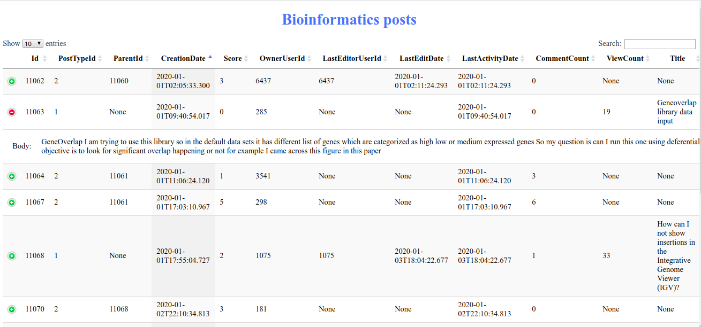
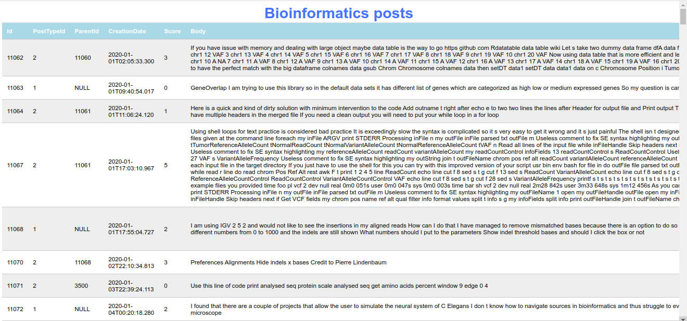

# gsoc-project-test
Selection Test for the Project "Ingesting the Canadian Common CV" under Canadian Centre for Computational Genomics organization

### Test description
Provided in the datatest/ directory is a XML file of posts made on the bioinformatics.stackexchange.com website (in 2020) : bioinformatics_posts_se.xml. 
With this dataset, you will build a simple python web application to serve this information with a few filtering options.

As with the project itself, it is recommended to use Flask framework.

1- First step is to ingest this file in a sqlite database.

2- Write an endpoint to return these posts, by default it should be in chronological order. By way of a query string in the URL, these posts may also be ordered by view count or score.

3- Write an endpoint to search these posts. Again, by way of a query string, filter the posts based on the presence of the search term, either in the title or body of the post.

Save your work in an external repository and send us a link to it.

### Test solution
1. To ingest xml file in a sqlite database I did not use available SQLite GUIs and CLIs to simply import data with a few clicks into sqlite table. 
[This module](./ingestFileToDB.py) is designed to create a table in SQLite and ingest data (as one batch) from XML file into SQLite table 

2. To return posts from SQLite table, the [following helper function](./retrieveDataFromDB.py) was implemented. 
```readSqliteTable``` is then called in flask application **app.py**.

3. To display posts in the browser (including sorting and search functionalities) I have 2 versions:  
  - 1st version by using the open-source javascript library [DataTables](https://datatables.net/). 
This library allows to add advanced features to HTML table such as pagination, instant search, multi-column ordering. 
The main motivation to use this library is to produce really good-looking tables. 



Besides, sorting by Score, ViewCount and searching by keywords are already available out-of-box by this library. 
That's why I created the 2nd version where I implemented subtasks 2 & 3 without any libraries and tools.  
These 2 approaches correspond to master (using DataTables) branch and alternative-solution branch (without DataTables).

  - 2nd version without using any libraries, just add CSS to make the table look good. 
By way of a query string in the URL, these posts (content of table) may be ordered by view count or score and filtered based on the presence of the search term, either in the title or body of the post. 
Use the argument "sorting" (/?sorting=Score) to sort the rows according to the specified column and use the "search" argument to search the posts containing keyword either in the title or body of the post. 




### Install and run project

```
git clone https://github.com/wingedRuslan/gsoc-project-test.git
cd gsoc-project-test
pip install -r requirements.txt
flask run
```

